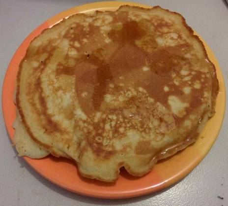

+++
title = "Fluffy Pancakes"
date = 2015-02-05T20:28:10+01:00

[taxonomies]
categories = ["recipes"]
+++

We made some *very fluffy* pancakes for breakfast last weekend :)

<!-- more -->

## The recipe

### Ingredients

* 1 cup all-purpose flour
* 2 tablespoons white sugar
* 1 teaspoon baking powder
* 1/2 teaspoon salt
* 2 tablespoons butter, melted
* 3/4 cup milk
* 1 egg

### Directions

1. Combine flour, sugar, baking powder and salt in a large mixing bowl. Whisk egg and butter into milk. Pour everything into the flour mixture and whisk until lumps are gone.
2. Heat a non-stick frying pan over a medium heat and add a knob of butter. When it's melted, add a ladle of batter and cook until bubbles appear on the surface. Flip with a spatula, and cook until browned on the other side.

Serve with maple syrup. Delicious.
