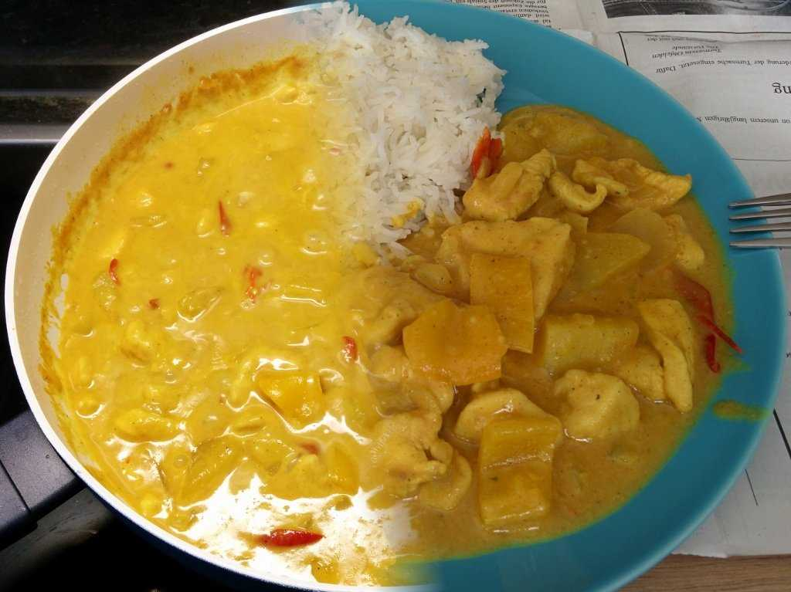

+++
title = "Home made curry"
date = 2015-08-03T21:26:57+02:00
draft = true

[taxonomies]
categories = ["recipes"]
+++

My home made curry recipe.

<!-- more -->

### Ingredients

* 2 chicken breasts
* all-purpose flour
* 1 onion
* 1 paprika
* 2 - 3 chillies (optional)
* 1 - 2 potato
* curry powder
* 5dl of bouillon
* 1 package of instant curry sauce
* 2dl of cream

### Directions

1. Poulet einmehlen
2. Poulet anbraten und wegstellen
3. Zwiebel, Paprika und Chilli und Kartoffeln schneiden und anbraten
4. Mit Bouillon und Curry Pulver ablöschen
5. Köcheln lassen.
6. Fleisch dazu geben und köcheln lassen.
7. Rahm dazu geben und servieren
